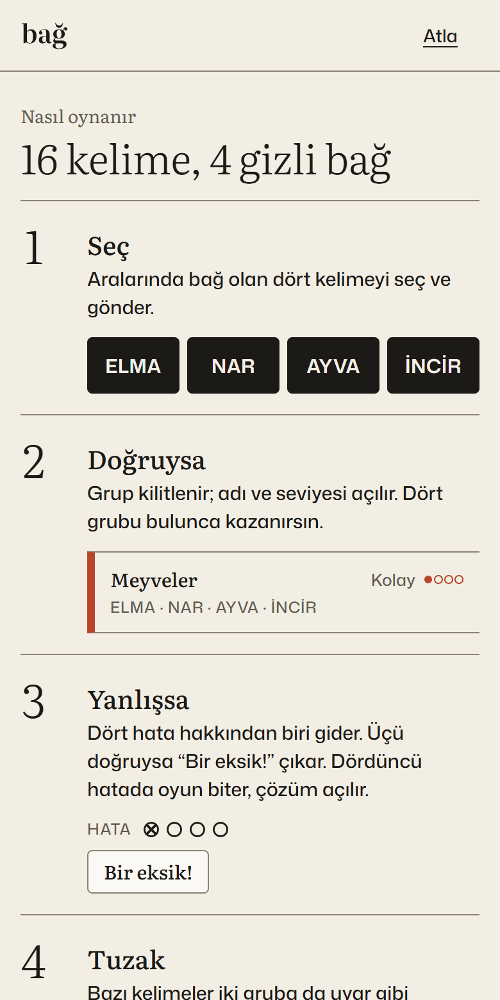
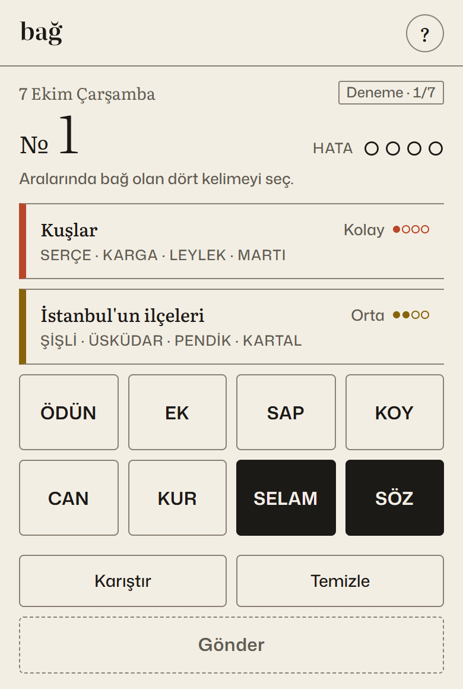
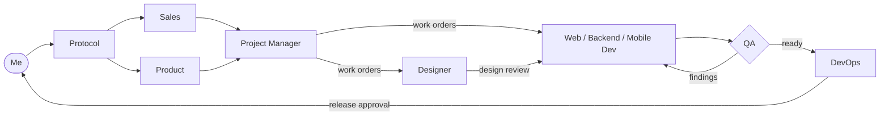

# Agent Workflow

I build software on my own, mostly with Claude Code. To make that reliable, I run a private multi-agent
workflow where planning, development, QA and releases follow written rules, and AI-written code is never
trusted until an independent step has checked it.

This repository describes how the workflow is designed, what it has shipped, and where it has failed. The
agent definitions themselves are private.

**In one release, the developer agent reported its work as green. The QA agent, which had not written the
code, still found 10 issues.** All 10 were fixed and retested before the release.
→ [Case study: from idea to a live user trial in 12 days](docs/CASE_STUDY.md)

<p>
  
  &nbsp;
  
</p>

<sub>Bağ, a daily Turkish word puzzle built through this workflow. Shown here: a past day's puzzle.</sub>

## Why

Working alone means no one reviews my plans, tests my code or catches my mistakes. An AI assistant used as
autocomplete makes me faster, but not more reliable. I wanted specialists with clear jobs and limits, and a
process where "done" means verified by someone other than the author.

## How it works

Each agent is a folder of plain Markdown files. Claude Code is the runtime: a root protocol tells it, for every
request, which agent to use, what to read first, which skill to follow step by step, where it must stop and ask
me, and where to record the result.



There are 14 agents in total, across engineering (web, backend, mobile, DevOps), quality, design and content,
product and delivery, and growth.

### What an agent definition looks like

The QA agent, as an outline. Section names are translated; the contents stay private.

```
qa/
├── AGENT.md        Mission · Why a separate agent · Goals and KPIs · Non-goals · Skills
│                   · Input contract · Output contract · What success looks like · Never
├── RULES.md        Read-only boundary · Production boundary · Can / cannot
│                   · How findings are written · Handoffs · Memory and records
├── HEARTBEAT.md    Triggers · Before every job · After every job · When to stop and ask
├── MEMORY.md       Lessons learned, dated
└── skills/
    ├── TEST_PLAN.md
    ├── RELEASE_CHECK.md   Purpose · Inputs · Process · Report format · Quality bar · Tools
    └── RETEST.md
```

## Principles

- **The author never signs off its own work.** QA writes its test plan before the code exists, files findings
  with a severity and exact reproduction steps, and retests every fix.
- **Work is handed off in writing.** Work orders, change requests and handoff packages, each with an owner and
  a definition of done.
- **Narrow permissions.** An agent writes only to its own folder and the project paths it is registered for.
  Shared reference files are read-only for agents; they can only propose changes.
- **I stay in the loop where it matters.** Agents stop and ask before publishing, spending money, contacting a
  real person, deleting anything or touching credentials.
- **A decision is not a completed action.** Anything in the outside world counts as done only after I confirm
  it.
- **Fix the context, not the prompt.** When an agent repeats a mistake, the fix goes into its rules, a skill
  step or its memory, not into a chat message.
- **No secrets in files.** Agents record the names of environment variables, never their values.

## What it has shipped

| Project | What | Evidence |
|---|---|---|
| [losyef.com](https://losyef.com) | Bilingual (TR/EN) studio website, 28 pages | Live; SEO and accessibility checks are release gates |
| [mtmobilyaizmir.com](https://www.mtmobilyaizmir.com) | Website for a furniture business in İzmir | Live |
| Bağ | Daily Turkish word puzzle, 7-day user trial (October 2026) | 110 unit tests, 105 browser checks, independent QA sign-off ([case study](docs/CASE_STUDY.md)) |

## Where it fails

The agents make mistakes that look like success: a record saying "done" when something was only decided, a
browser check that passed before the page had finished loading. Each of these became a rule.
→ [Lessons: where the agents failed, and how it was caught](docs/LESSONS.md)

## Why the source is private

The workflow runs the websites and products I build, and its files contain project history I can't publish.
It is also the result of a lot of iteration that I'd rather not hand over as a template. I'm happy to walk
through it in detail on a call.

## Rights

Copyright © 2026 Yusuf Irmalı. All rights reserved.

---

[Yusuf Irmalı](https://github.com/irmaliyusuff) · İzmir · [losyef.com](https://losyef.com)
